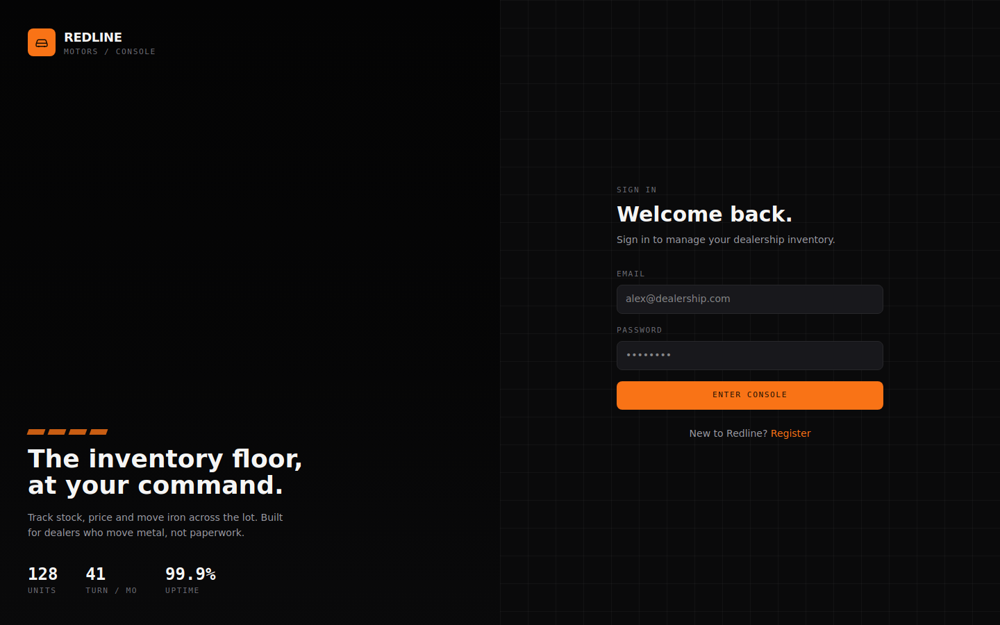

# Redline Motors — Car Dealership Inventory System

A full-stack inventory system for a car dealership: register/log in, browse and search the
lot, purchase a vehicle (decrements stock), and — for admins — add, edit, delete, and restock
vehicles. Built as a TDD kata.

- **Backend:** NestJS + TypeScript, MongoDB (Mongoose), JWT auth, Jest (unit + e2e)
- **Frontend:** React + TypeScript + Tailwind CSS v4 (Vite)

## Project structure

```
car-dealership/
├── backend/      NestJS REST API
├── frontend/     React SPA
├── docs/screenshots/
├── TEST_REPORT.md
├── PROMPTS.md
└── README.md      (this file)
```

## Screenshots

**Sign in**



**The Floor — admin mode** (edit / restock / delete a vehicle, add a new one)


**The Floor — showroom mode** (purchase a vehicle; sold-out units are disabled)


## Getting started

### Prerequisites

- Node.js 18+ and npm
- A MongoDB instance — either:
  - a local MongoDB (`mongod` running on `localhost:27017`), or
  - a free [MongoDB Atlas](https://www.mongodb.com/atlas) cluster (use its connection string)

### 1. Backend

```bash
cd backend
npm install
cp .env.example .env
# edit .env if your MongoDB URI, JWT secret, or port differ from the defaults
npm run start:dev
```

The API starts on **http://localhost:3000** by default. Key environment variables (see
`.env.example`):

| Variable       | Purpose                                   | Default                                   |
| -------------- | ------------------------------------------ | ------------------------------------------ |
| `MONGODB_URI`  | Mongo connection string                    | `mongodb://localhost:27017/car-dealership` |
| `JWT_SECRET`   | Secret used to sign JWTs                   | *(set a real secret in production)*        |
| `JWT_EXPIRES_IN` | Token lifetime                           | `1d`                                       |
| `PORT`         | HTTP port                                  | `3000`                                     |
| `CORS_ORIGIN`  | Allowed frontend origin                    | `http://localhost:5173`                    |

#### Running the backend tests

```bash
npm test           # unit tests (23 tests, no DB required — see TEST_REPORT.md)
npm run test:cov   # unit tests with a coverage report
npm run test:e2e   # end-to-end tests against an in-memory MongoDB (mongodb-memory-server)
```

> The e2e suite downloads a small MongoDB binary the first time it runs, so it needs normal
> outbound internet access on that first run (cached afterwards). See `TEST_REPORT.md` for
> details and results.

### 2. Frontend

In a second terminal:

```bash
cd frontend
npm install
cp .env.example .env
# edit .env if your backend isn't on http://localhost:3000
npm run dev
```

The app starts on **http://localhost:5173**. Register a new account (the first field you set
`role` to is only settable via the API directly — see below — everyone who registers through
the UI gets the `user` role by default).

#### Creating an admin account

The register form always creates a regular `user`. To try the admin experience (add / edit /
delete / restock), either:

- register normally, then flip that user's `role` field to `"admin"` directly in MongoDB, **or**
- call the API directly with a role field:
  ```bash
  curl -X POST http://localhost:3000/api/auth/register \
    -H "Content-Type: application/json" \
    -d '{"name":"Alex Admin","email":"alex@dealership.com","password":"adminpass1","role":"admin"}'
  ```

### 3. Build for production

```bash
cd backend && npm run build && npm run start:prod
cd frontend && npm run build   # outputs static assets to frontend/dist
```

## API reference

All `Vehicles` routes require a `Authorization: Bearer <token>` header. Routes marked
**(admin)** additionally require the caller's JWT to carry `role: "admin"`.

| Method | Route                          | Description                          |
| ------ | ------------------------------- | ------------------------------------- |
| POST   | `/api/auth/register`            | Create an account, returns a JWT      |
| POST   | `/api/auth/login`                | Log in, returns a JWT                 |
| GET    | `/api/vehicles`                  | List all vehicles                     |
| GET    | `/api/vehicles/search`           | Filter by `make`, `model`, `category`, `minPrice`, `maxPrice` |
| GET    | `/api/vehicles/:id`               | Get one vehicle                       |
| POST   | `/api/vehicles`                  | Create a vehicle **(admin)**          |
| PUT    | `/api/vehicles/:id`               | Update a vehicle **(admin)**          |
| DELETE | `/api/vehicles/:id`               | Delete a vehicle **(admin)**          |
| POST   | `/api/vehicles/:id/purchase`      | Buy one unit (quantity − 1)           |
| POST   | `/api/vehicles/:id/restock`       | Body `{ "amount": n }` (quantity + n) **(admin)** |

## Testing approach (TDD)

The backend was built red → green, spec-first, for both service layers:

1. `AuthService` — a failing spec (`auth.service.spec.ts`) was committed before any
   implementation existed, then `auth.service.ts` was written to make it pass (5/5 tests).
2. `RolesGuard` — same pattern, spec first, then implementation (4/4 tests).
3. `VehiclesService` — the largest spec, covering CRUD, search-filter construction, purchase
   (with an out-of-stock guard), and restock (with a positive-amount guard), written before
   the service existed (14/14 tests).

Controllers, modules, DTOs, and the JWT strategy are then integration-tested end-to-end
(`test/*.e2e-spec.ts`) rather than unit-tested in isolation, since their only real logic is
delegation/wiring. See `TEST_REPORT.md` for full results, coverage numbers, and a note on why
the e2e suite couldn't be executed inside the build sandbox.

## My AI Usage

**Tool used:** Claude (Anthropic), via the Claude.ai chat/agentic coding interface, for the
entire build.

**How I used it:**

- **Scaffolding & config** — Claude generated the initial NestJS `package.json`, `tsconfig`,
  and `nest-cli.json`, and the Vite + React + TypeScript + Tailwind v4 frontend scaffold.
- **TDD workflow** — For each backend module I had Claude write the unit test file first
  (enumerating edge cases like duplicate-email registration, out-of-stock purchases, and
  non-positive restock amounts), run it to confirm it failed for the right reason, *then*
  write the implementation and re-run until green. That red→green sequence is preserved in
  the git history, and every commit that used AI assistance carries a `Co-authored-by`
  trailer per the kata's requirements.
- **Debugging** — Claude diagnosed and fixed a couple of real issues along the way: a
  `bcrypt` mock that broke because you can't `jest.spyOn` a native-binding property (switched
  to `jest.mock('bcrypt', ...)`), and a `supertest` default-import TypeScript error under this
  project's `esModuleInterop` settings.
- **Design matching** — I gave Claude three screenshots of a Lovable-built reference UI (a
  dark "console" aesthetic — near-black background, orange accent, condensed display
  typography, monospaced data) and asked it to reproduce that look. Claude translated the
  screenshots into a concrete Tailwind v4 design-token system (`@theme` colors, fonts) and
  built the React components against those tokens, then used a headless-Chrome screenshot of
  its own running dev server to self-check the result against the reference before handing it
  back to me.
- **Documentation** — This README, `TEST_REPORT.md`, and `PROMPTS.md` were drafted by Claude
  from the actual commands run and actual test output produced during the build, then reviewed
  by me.

**Reflection:** The TDD loop is where AI assistance paid off the most concretely — having
Claude write the spec first, actually run it to confirm a real failure, and only then
implement, kept me honest about red→green instead of writing tests that describe code that
already exists. The riskiest part of AI-assisted work is trusting output I haven't verified;
I mitigated that by having every backend claim checked against a real `tsc`/`jest` run rather
than taken on faith, and by reading through the generated component code for the frontend
before accepting it, especially the auth/role-gating logic. The design-matching workflow was
the most interesting part — turning a handful of screenshots into a reusable design-token
system is exactly the kind of translation work AI is well suited to, but it still needed a
human pass to check spacing, wording, and empty/loading/error states that weren't visible in
the reference screenshots at all.

## Known limitations / next steps

- The frontend has no automated test suite yet (Vitest + React Testing Library would be the
  natural next step, mirroring the backend's Jest setup).
- The register form always creates a `user`; there's no in-app "become an admin" flow (see
  above for how to create one via the API).
- `test:e2e` requires outbound network on its first run to fetch a MongoDB binary (see
  `TEST_REPORT.md`).
